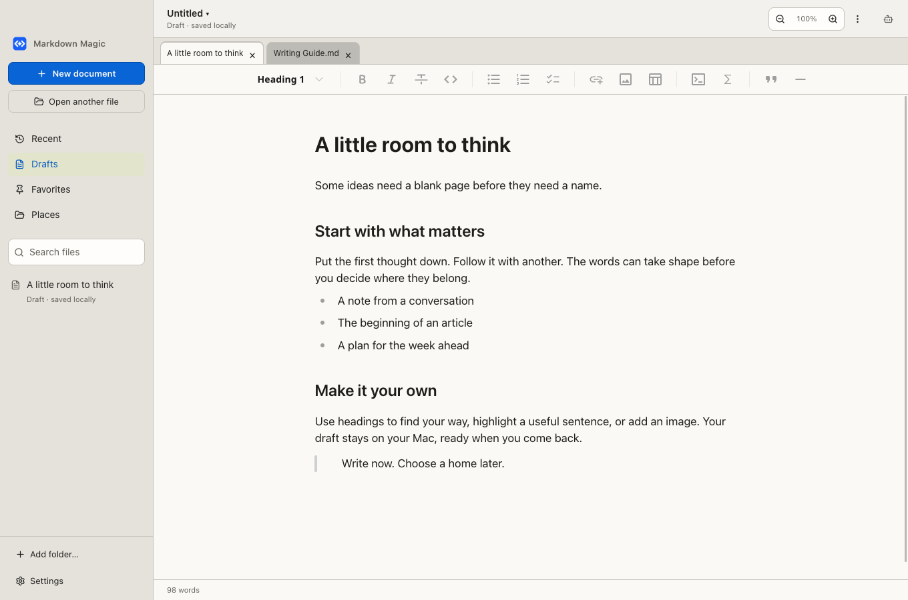
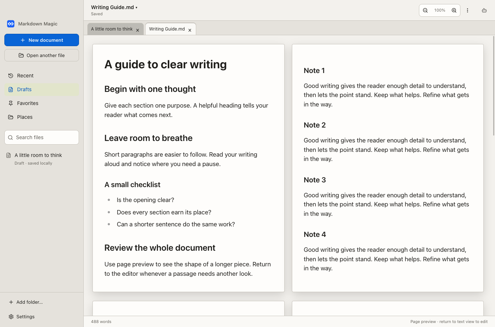
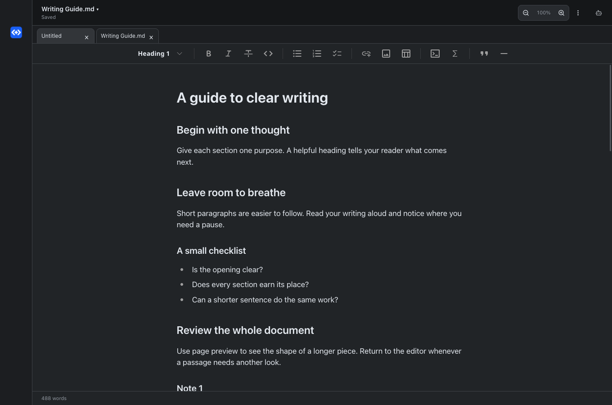

# Markdown Magic

**Deutsch** | [English](#english)

Ein visueller Markdown-Editor für den Mac: Öffnen, schreiben, wiederfinden. Neue Dokumente werden automatisch als lokale Entwürfe gesichert. Name und Speicherort wählst du später.

[Website](https://markdown-magic.pages.dev/) · [Download 0.2.0 für Apple Silicon](https://github.com/MediaPublishing/markdown-magic/releases/download/v0.2.0/Markdown-Magic-0.2.0-arm64.dmg) · [Versionshinweise](docs/RELEASE-0.2.0.md)



## Schreiben ohne Vorarbeit

1. **⌘N:** Sofort mit einem leeren Dokument anfangen.
2. **Einfach schließen:** Dein Text bleibt in „Entwürfe“ erhalten.
3. **⌘S:** Wenn du bereit bist, Name und Ablageort im Mac-Sichern-Dialog wählen.

Bestehende Dateien öffnest du mit **⌘O**, über den Finder oder über deine Orte in der Seitenleiste. Änderungen werden automatisch gesichert. Ordnerwechsel lässt geöffnete Dokumente stehen.

## Im Alltag

- Zuletzt, Entwürfe, Favoriten und Orte zum Wiederfinden
- Visuelles Markdown, mit einer sicheren Quelltextansicht für nicht unterstützte Strukturen und andere Textformate
- Suchen und Ersetzen, Dokumentgliederung, lokale Bilder
- Dokumenttitel mit Aktionen zum Benennen, Bewegen, Duplizieren und Anzeigen im Finder
- Kopieren als Markdown oder formatierten Text; PDF-Export und Drucken
- Eigener Editorzustand samt Rückgängig pro geöffnetem Dokument
- Lokale Wiederherstellungskopien, Konfliktvergleich und Versionsvorschau
- Fortlaufende Ansicht oder Seitenvorschau, Dokumentzoom, optionale Tabgruppen
- Deutsche und englische Oberfläche; helle, dunkle und Systemdarstellung
- Optionaler Assistent mit Vorschau und Rückgängig



## Installation und Updates

1. [DMG herunterladen](https://github.com/MediaPublishing/markdown-magic/releases/download/v0.2.0/Markdown-Magic-0.2.0-arm64.dmg).
2. `Markdown Magic.app` nach `Programme` ziehen.
3. Falls macOS die Beta blockiert, den Start in den Systemeinstellungen unter Datenschutz & Sicherheit bestätigen.

**Apple Silicon, macOS 13+.** Die Beta ist ad-hoc signiert, aber noch nicht von Apple notarisiert. Updates sind über das App-Menü und die [Release-Seite](https://github.com/MediaPublishing/markdown-magic/releases) erreichbar; sie werden manuell installiert.

Vorhandene Sitzungen werden mit einer Sicherung der alten Sitzungsdatei übernommen. Dokumentdateien werden nicht umsortiert. Entwürfe, Wiederherstellung und Historie liegen lokal im App-Datenordner. Ein vollständiges Systembackup bleibt sinnvoll: Die Wiederherstellung kann letzte Eingaben, die bei Stromausfall noch nicht auf die Festplatte geschrieben wurden, nicht garantieren.

## Datenschutz

Schreiben benötigt weder Konto noch Internet. Keine Telemetrie, kein proprietäres Dokumentformat. Der optionale Online-Assistent verwendet den vorhandenen lokalen Codex-Zugang und überträgt Dokumentinhalt erst nach einer bewussten Anfrage. Die Offline-Dokumenthilfe ist regelbasiert.

## Entwicklung

```sh
npm install
npm run dev
npm run quality
npm run package:mac
```

Die Tests verwenden eigene temporäre Profile und Testdokumente. Für einen Test des gebauten App-Pakets kann `MARKDOWN_MAGIC_E2E_EXECUTABLE` auf die ausführbare Datei im App-Bundle gesetzt werden.

## English

A visual Markdown editor for Mac: open, write, find it again. New documents are automatically saved as local drafts. Choose their names and locations later.

[Website](https://markdown-magic.pages.dev/en/) · [Download 0.2.0 for Apple Silicon](https://github.com/MediaPublishing/markdown-magic/releases/download/v0.2.0/Markdown-Magic-0.2.0-arm64.dmg) · [Release notes](docs/RELEASE-0.2.0.md)



## Start writing

1. **⌘N:** Start a blank document immediately.
2. **Close it:** Your writing remains in Drafts.
3. **⌘S:** Choose a name and location in the Mac save dialog when you are ready.

Open existing files with **⌘O**, Finder or Places. Changes save automatically. Switching folders keeps your open documents intact.

## Everyday tools

- Recent, Drafts, Favorites and Places
- Visual Markdown with safe source editing for unsupported structures and other text formats
- Find and replace, document outline and local images
- Title actions for naming, moving, duplicating and revealing files
- Markdown/formatted copy, PDF export and printing
- Independent editing state and Undo for each open document
- Local recovery, conflict comparison and version previews
- Continuous editing or page preview, document zoom and optional tab groups
- German/English; light, dark and system appearance
- Optional assistant with preview and Undo

## Install and update

[Download the DMG](https://github.com/MediaPublishing/markdown-magic/releases/download/v0.2.0/Markdown-Magic-0.2.0-arm64.dmg), then drag the app into Applications. If macOS blocks the beta, confirm it in System Settings → Privacy & Security.

**Apple Silicon, macOS 13+.** This beta is ad-hoc signed and not yet notarized by Apple. Updates are available through the app menu and [releases](https://github.com/MediaPublishing/markdown-magic/releases) and are installed manually. Existing sessions are migrated with a backup; document files stay where they are. Recovery protects local writes but cannot guarantee final keystrokes not yet written to disk during a power failure.

Writing needs no account or internet connection. No telemetry or proprietary format. The optional online assistant uses the existing local Codex sign-in and sends document content only after an explicit request. Offline document help uses rules, not a language model.

## License

No open-source license has been granted. Source is publicly available for inspection; all rights remain reserved.
